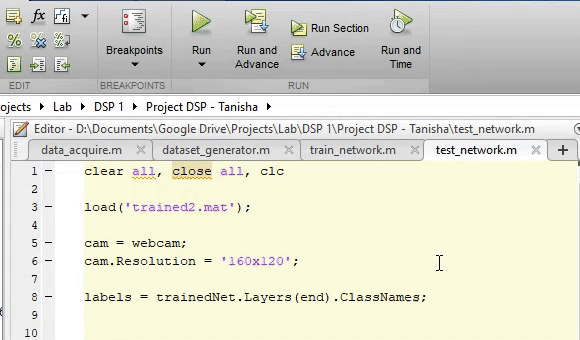

# Bangla-Sign-Language-Recognition-CNN

> Digital Signal Processing laboratory final project for detecting Bengali sign language from image frames using convolutional neural networks

> This project detects sign language from image data using a convolutional neural network model running on MATLAB.

> The project was ported from my own project <a href="https://github.com/ClockWorkKid/Bangla-Number-Recognition-CNN">Bangla-Number-Recognition-CNN</a> which was originally implemented following a MATLAB example project titled <a href="https://www.mathworks.com/help/deeplearning/ug/deep-learning-speech-recognition.html">"Speech Command Recognition Using MATLAB"</a> 

## Algorithm

The sign recognition algorithm works as follows:

- Image frames are first acquired and preprocessed to create a dataset.
- In the training phase, the image dataset is fed to a CNN network along with the class labels, and the final loss function used is a binary cross entropy.
- New samples are passed through the network at runtime, and predictions generated with the trained network

## Workflow

**Data collection**
- Image samples was collected and saved to harddisk using the "Matlab code/data_acquire.m" script
- Image samples are converted to a .mat dataset using the "Matlab code/dataset_generator.m" script

**Training Model**

- "Matlab code/train_network.m" script was used to train the model and save the model parameters to another .mat file

**Testing Model**

- "Matlab code/test_network.m" script was used to load the trained network from the .mat file and make predictions from image stream of webcam

